 Ce projet est conçu pour présenter les concepts clés de la mise en réseau à l'aide de Cisco Packet Tracer.
  
## Exercises  

### Exercise 1:

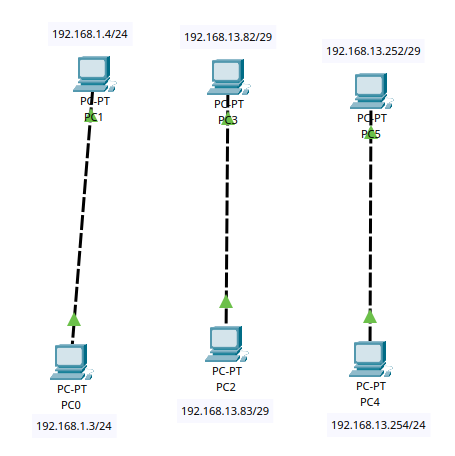

- **Steps**:

1. Connecter PC0 à PC1 | PC2 à PC3 | PC4 à PC5 à l'aide de câbles croisés

2. Configurer les IP statiques manuellement.

- PC0: 192.168.1.3/24

- PC1: 192.168.1.4/24

- PC2: 192.168.13.83/29

- PC3: 192.168.13.82/29

- PC4: 192.168.13.254/24

- PC5: 192.168.13.252/29

1. Tester la connectivité à l'aide de la commande `ping` et les simulations.

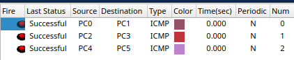

- **Composants réseaux**: PC, Câbles croisés.

- **Knowledge**:

*RJ45 signifie « Registered Jack 45 ». Il s'agit d'un type standard de connecteur physique pour les câbles de réseau.*

*straight-through : Utilisé pour connecter différents types d'appareils, comme un ordinateur à un switch. Les deux extrémités ont la même séquence de fils.*

*Crossover cables : Utilisé pour connecter des appareils similaires, comme dans l'exo deux ordinateurs. L'une des extrémités présente une séquence de fils inversée pour connecter les broches de transmission aux broches de réception.* 
  

---
### Exercise 2:

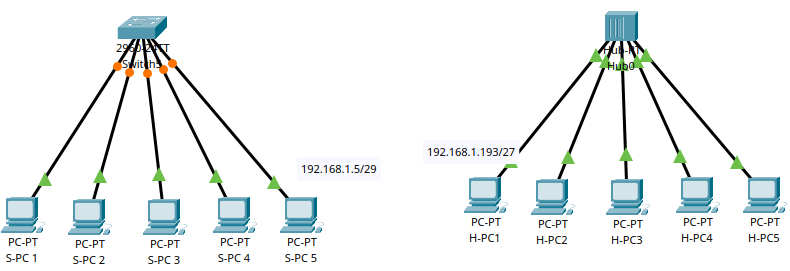

- **Steps for S-PC to Switch**:

1. Connecter les S-PC 1,2,3,4 AU Switch avec des straight-through cables.

2. Configurer les IP statiques des S-PC

- S-PC1: 192.168.1.1/29

- S-PC2: 192.168.1.2/29

- S-PC3: 192.168.1.3/29

- S-PC4: 192.168.1.4/29

- S-PC5: 192.168.1.5/29

- **Steps for H-PC to HUB**:

3. Connecter les H-PC 1,2,3,4 au Switch avec des straight-through cables.

4. Configurer les IP statiques des S-PC

- H-PC1: 192.168.1.193/27

- H-PC2: 192.168.1.194/27

- H-PC3: 192.168.1.195/27

- H-PC4: 192.168.1.196/27

- H-PC5: 192.168.1.197/27

5. Tester la connectivité à l'aide de la commande `ping` et les simulations.

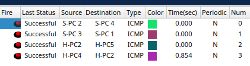
  
- **Composants réseaux**: PC, Switch, HUB, straight-through cables.

- **Knowledge**:

- Understand the function of a switch and a hub, how they operate and their role in networking.

***HUB :***

*Fonction : Il connecte plusieurs appareils dans un réseau. Il diffuse toutes les données reçues d'un port à tous les autres ports, quelle que soit la destination.*

*Fonctionnement : Il reçoit des données d'un appareil connecté, il répète ces données à tous les autres appareils connectés. Cela signifie que tous les appareils du réseau voient l'ensemble du trafic, ce qui peut entraîner des collisions et un manque d'efficacité.*

*Rôle dans la mise en réseau : les HUBs sont utilisés pour créer une connexion réseau simple entre plusieurs appareils, mais ils sont largement dépassés en raison de leur inefficacité et de leur manque d'intelligence dans la gestion du trafic réseau.*

***Switch :***

*Fonction :  Il connecte plusieurs appareils dans un réseau. Contrairement à un HUB, un switch peut diriger intelligemment les données vers l'appareil spécifique auquel il est destiné.*

*Fonctionnement : Un switch utilise les adresses MAC pour déterminer la source et la destination des paquets de données. Il tient à jour une table des adresses MAC et des ports correspondants, ce qui lui permet d'envoyer des données uniquement au port où est connecté l'appareil destinataire prévu.*

*Rôle dans la mise en réseau : Les switchs sont utilisés pour améliorer l'efficacité et les performances du réseau en réduisant le trafic inutile et les collisions. Ils sont essentiels dans les réseaux Ethernet modernes.*

- Differentiate between the switch and the hub.

*Traitement du trafic :*

*Hub : Diffuse des données sur tous les ports, ce qui entraîne davantage de collisions et un gaspillage de la bande passante.*

*Switch : Dirige les données uniquement vers le port prévu, ce qui réduit les collisions et améliore l'utilisation de la bande passante.*

*Intelligence* :

*Hub : Manque d'intelligence ; répète simplement les signaux vers tous les ports.*

*Switch : Utilise les adresses MAC pour acheminer intelligemment les données vers le bon port.*

*Performance :*

*HUB : Les performances du réseau sont généralement moins bonnes en raison des collisions et de la diffusion du trafic.*

*Switch : Fournit de meilleures performances en gérant efficacement le trafic du réseau.*

- Identify the OSI model layer that the switch and hub operate on.

*Hub : Opère au niveau de la couche physique (couche 1) du modèle OSI. Il traite des flux de bits bruts et n'interprète aucune donnée.*

*Switch : Fonctionne au niveau de la couche de liaison de données (couche 2) du modèle OSI. Il utilise les adresses MAC pour prendre des décisions de transfert, ce qui lui permet de diriger intelligemment le trafic au sein d'un réseau local.*

---
### Exercise 3:

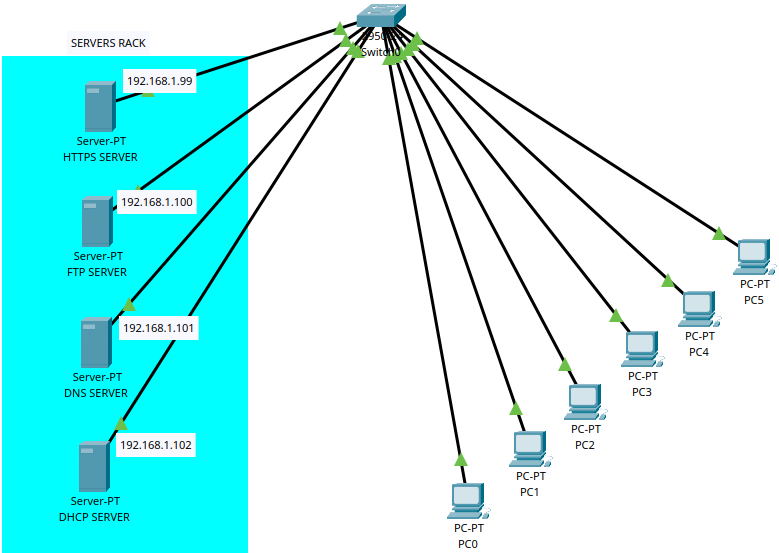

- **Composants réseaux**: PC,Servers,Câbles croisés.
- **Steps**:
1. Connecter les PC et les server au switch afin qu'ils puissent communiquent entre eux
2. Configurer les 4 servers : HTTPS ; FTP SERVER ; DNS ; DHCP
   Attribuer pour chacun leurs ip statique. SOUS RÉSEAU: 192.168.1.0/24
- HTTPS SERVER: 192.168.1.99

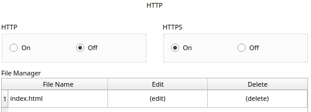

Le "https://deep-in-net.com" doit rediriger `HTTPS server`

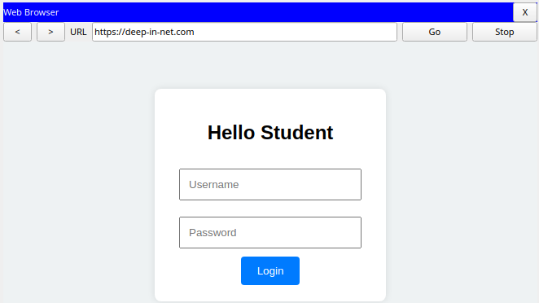

On active uniquement le port 433 HTTPS pour la sécurité.

- FTP SERVER: 192.168.1.100

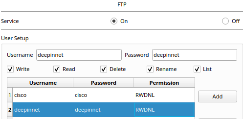

On crée un compte user pour le FTP: Username et Password: `deepinnet`; Permissions: Read,Write,Delete,Rename and List

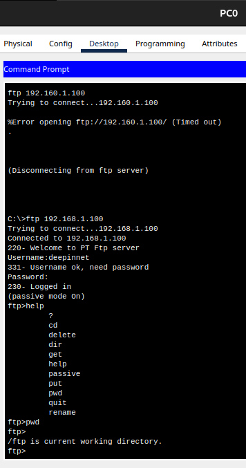

- DNS SERVER: 192.168.1.101

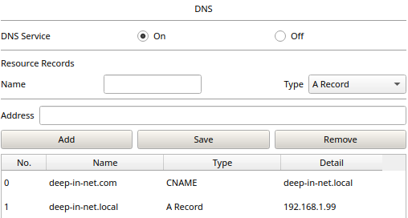

- DHCP SERVER: 192.168.1.102

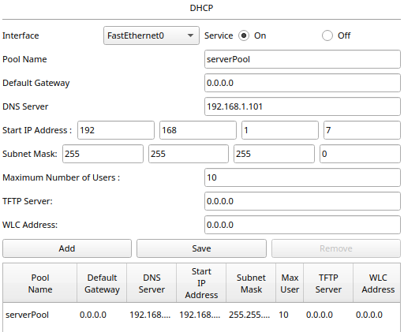

3. Le server DHCP attribue les IP automatiquement aux PC sur une plage d'adresses imposée. Maximum Number of Users: 10
	- PC0: 192.168.1.12/24
	- PC1: 192.168.1.11/24
	- PC2: 192.168.1.10/24
	- PC3: 192.168.1.9/24
	- PC4: 192.168.1.7/24
	- PC5: 192.168.1.8/24

- **Knowledge**:
	- Define a `server` and its purpose in networking.
			*En réseau informatique, un serveur est un ordinateur ou un système qui fournit des ressources, des données, des services ou des programmes à d'autres ordinateurs, appelés clients, sur un réseau. Les serveurs sont conçus pour être performants, fiables et capables de gérer plusieurs requêtes simultanément.*
	- Explain `DHCP` and how it operates in a network.
			DHCP, ou Dynamic Host Configuration Protocol, est un protocole réseau utilisé pour attribuer automatiquement des adresses IP et d'autres paramètres de configuration réseau aux appareils sur un réseau. Cela permet aux appareils de se connecter à un réseau IP et de communiquer avec d'autres appareils sans nécessiter une configuration manuelle.
	- Define `DNS` and its role in network communication.
		    Le DNS, ou Domain Name System (Système de Noms de Domaine), est un système essentiel dans les réseaux informatiques qui sert principalement à traduire les noms de domaine en adresses IP. Les noms de domaine sont des chaînes de caractères faciles à retenir, comme "[deep-in-net.com](http://deep-in-net.com)", tandis que les adresses IP sont des séries de chiffres, comme "192.168..99", que les ordinateurs utilisent pour identifier et communiquer entre eux sur un réseau.
	- Understand the purpose of `HTTP` and how it is used in networking.
			HTTP, ou HyperText Transfer Protocol (Protocole de Transfert Hypertexte), est un protocole de communication utilisé pour transférer des données sur le web. Il définit comment les messages sont formatés et transmis, et comment les serveurs web et les navigateurs doivent répondre à diverses commandes. Il est par défaut sur le port 80.
	- Explain `HTTPS` and how it is different from `HTTP`.
			HTTPS, ou HyperText Transfer Protocol Secure (Protocole de Transfert Hypertexte Sécurisé), est une version sécurisée du protocole HTTP. Il est utilisé pour protéger la communication entre un navigateur web et un serveur en chiffrant les données échangées.
	- Understand the purpose of `FTP` and how it operates in network communication.
		    FTP, ou File Transfer Protocol (Protocole de Transfert de Fichiers), est un protocole réseau standard utilisé pour transférer des fichiers d'un hôte à un autre sur un réseau basé sur TCP (Transmission Control Protocol), comme Internet.
	- Define `TCP` and `UDP` communication and differentiate between them.
	
		    TCP est un protocole orienté connexion qui assure une transmission fiable et ordonnée des données entre les appareils sur un réseau. Il est conçu pour les applications qui nécessitent une livraison fiable des données.
			UDP est un protocole sans connexion qui permet une transmission rapide et efficace des données, mais sans garantie de livraison, d'ordre ou de protection contre la duplication.
			
		- TCP est utilisé pour les applications nécessitant une transmission fiable et ordonnée des données, tandis que UDP est utilisé pour les applications nécessitant une transmission rapide et efficace, même au détriment de la fiabilité.
		
	- Identify the `OSI model layer` where `TCP` and `UDP` operate.
		    TCP (Transmission Control Protocol) et UDP (User Datagram Protocol) opèrent tous deux au niveau de la couche Transport du modèle OSI (Open Systems Interconnection). Cette couche est la quatrième couche du modèle OSI, qui est composé de sept couches au total.
	- Define a `port` in networking and its function.
		    Un port, dans le contexte des réseaux informatiques, est un point de communication virtuel utilisé pour échanger des informations entre un appareil et un réseau ou entre des applications sur un même appareil. Les ports permettent à plusieurs services ou applications de fonctionner simultanément sur un seul appareil sans interférer les uns avec les autres.
	- Identify the `port` and `OSI model layer` for each protocol used.

| Protocole           | Port par défaut | Couche OSI         |
| ------------------- | --------------- | ------------------ |
| HTTP                | 80              | Application        |
| HTTPS               | 443             | Application        |
| FTP                 | 20, 21          | Application        |
| SFTP                | 22              | Application        |
| SSH                 | 22              | Application        |
| Telnet              | 23              | Application        |
| SMTP                | 25              | Application        |
| DNS                 | 53              | Application        |
| DHCP                | 67, 68          | Application        |
| TFTP                | 69              | Application        |
| POP3                | 110             | Application        |
| IMAP                | 143             | Application        |
| SNMP                | 161             | Application        |
| LDAP                | 389             | Application        |
| HTTPS (alternative) | 8443            | Application        |
| SQL Server          | 1433            | Application        |
| MySQL               | 3306            | Application        |
| RDP                 | 3389            | Session            |
| NTP                 | 123             | Transport          |
| TCP                 | N/A             | Transport          |
| UDP                 | N/A             | Transport          |
| IP                  | N/A             | Réseau             |
| ICMP                | N/A             | Réseau             |
| ARP                 | N/A             | Liaison de données |
| Ethernet            | N/A             | Liaison de données |
	- Understand the different types of `DNS` records.
			
		Les enregistrements DNS (Domain Name System) sont des instructions stockées dans des serveurs DNS qui fournissent des informations sur un domaine. Chaque type d'enregistrement DNS a un but spécifique et fournit des informations différentes.

---
### Exercise 4:

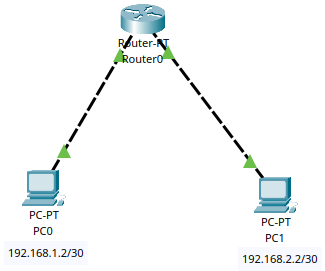

- **Steps**:
1. Connecter PC0 et PC1 au Router afin qu'ils communiquent entre eux

2. Configurer les IP statiques des pc manuellement et les interfaces du routeurs.

- PC0: 192.168.1.2/30  Default Gateway: 192.168.1.1
- PC1: 192.168.2.2/30  Default Gateway: 192.168.2.1
- Routeur FastEthernet0/0: 192.168.1.1/30 
- Routeur FastEthernet1/0: 192.168.2.1/30 

3. Tester la connectivité à l'aide de la commande `ping` et les simulations.

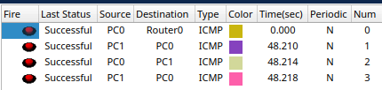

- **Composants réseaux**: PC,Routeur, Câbles croisés.

- **Knowledge**:

- What is a `router` and what is its role?

Un routeur est un appareil réseau utilisé pour connecter plusieurs réseaux informatiques et diriger le trafic de données entre eux. Il fonctionne principalement au niveau de la couche réseau (couche 3) du modèle OSI et est essentiel pour le fonctionnement d'Internet et des réseaux locaux.

- Differentiate between the switch and the router.
- Identify the `OSI model layer` where a `router` operates.

| **Caractèristique**     | **Commutateur**                                 | **Routeur**                                            |
| ----------------------- | ----------------------------------------------- | ------------------------------------------------------ |
| **Niveau OSI**          | Couche de liaison de données (Couche 2)         | Couche réseau (Couche 3)                               |
| **Fonction principale** | Commutation de paquets au sein d'un même réseau | Acheminement des paquets entre différents réseaux      |
| **Utilisation**         | Connexion d'appareils au sein d'un LAN          | Connexion de différents réseaux, comme un LAN à un WAN |
| **Adresses utilisées**  | Adresses MAC                                    | Adresses IP                                            |
| **Segmentation**        | Réduit les collisions de paquets dans un LAN    | Dirige le trafic entre différents réseaux              |
En résumé, les Switch sont utilisés pour connecter et optimiser la communication entre les appareils au sein d'un même réseau local, tandis que les Router sont utilisés pour connecter différents réseaux et diriger le trafic entre eux.

- Understand the term "default gateway".

Le terme default gateway est un nœud dans un réseau informatique que les appareils utilisent pour accéder à d'autres réseaux lorsque la destination n'est pas dans le même réseau local.

### Exercise 5:

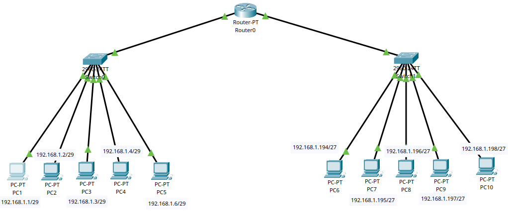

**Steps**:
1. Connecter les PC1-PC5  au Switch0
- PC1: 192.168.1.2/29  Default Gateway: 192.168.1.5
- PC2: 192.168.1.2/29  Default Gateway: 192.168.1.5
- PC3: 192.168.1.3/29  Default Gateway: 192.168.1.5
- PC4: 192.168.1.4/29  Default Gateway: 192.168.1.5
- PC5: 192.168.1.6/29  Default Gateway: 192.168.1.5

1. Connecter les PC6-PC10  au Switch1
- PC1: 192.168.1.194/29  Default Gateway: 192.168.1.193
- PC2: 192.168.1.195/29  Default Gateway: 192.168.1.193
- PC3: 192.168.1.196/29  Default Gateway: 192.168.1.193
- PC4: 192.168.1.197/29  Default Gateway: 192.168.1.193
- PC5: 192.168.1.198/29  Default Gateway: 192.168.1.193

3. Attribuer les ip gateway des routeurs
- Routeur FastEthernet0/0: 192.168.1.5/30 
- Routeur FastEthernet1/0: 192.168.1.193/30 

4. Tester la connectivité à l'aide de la commande `ping` et les simulations.

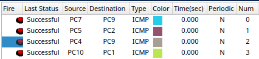

### Exercise 6:

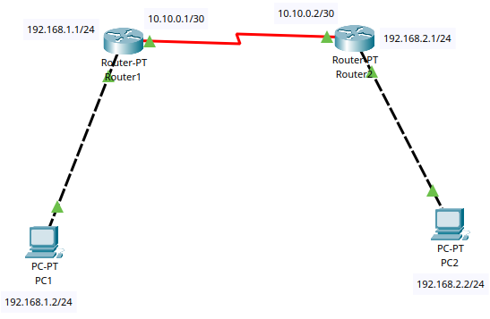

**Composants réseaux**: PC, Router, Cable serial dte and crossover cable.

1. Connecter les PC1-PC5  au Switch0
- PC1: 192.168.1.2/29  Default Gateway: 192.168.1.5
- PC1: 192.168.1.2/29  Default Gateway: 192.168.1.5

2. Attribuer les ip gateway aux Routers 
* Router1: ip LAN: 192.168.1.1/24 et ip WAN: 10.10.0.1/30
* Router2: ip LAN: 192.168.2.1/24 et ip WAN: 10.10.0.2/30

3. Donner les routes pour chaque routeurs

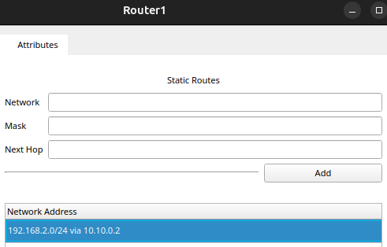
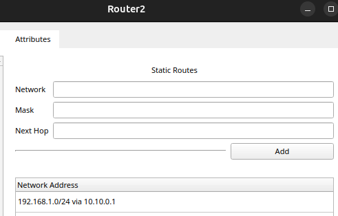

4. Tester la connectivité à l'aide de la commande `ping` et les simulations.

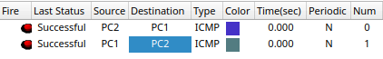

**Knowledge:

- What is a routing table and explain its role in routing network traffic.

Une table de routage est une base de données ou un ensemble d'informations stockées dans un routeur ou un appareil réseau qui détermine où les paquets de données doivent être envoyés. Elle joue un rôle crucial dans le processus de routage du trafic réseau en fournissant les informations nécessaires pour diriger les paquets de données de la source à la destination.

### Rôle de la table de routage

1. **Détermination du chemin** : La table de routage permet au routeur de déterminer le meilleur chemin pour envoyer les paquets de données. Lorsqu'un paquet arrive sur un routeur, celui-ci examine l'adresse IP de destination du paquet et consulte sa table de routage pour décider vers quelle interface et quelle passerelle envoyer le paquet.
    
2. **Optimisation du trafic** : En utilisant des métriques, la table de routage permet de choisir le chemin le plus efficace pour acheminer les paquets. Les métriques peuvent être basées sur des facteurs tels que le nombre de sauts, la bande passante, la latence, et d'autres critères de performance.
    
3. **Gestion des réseaux** : Les tables de routage permettent aux administrateurs réseau de configurer et de gérer le trafic réseau de manière centralisée. Ils peuvent définir des routes statiques ou utiliser des protocoles de routage dynamiques pour mettre à jour automatiquement les tables de routage en fonction des changements dans la topologie du réseau.
    
4. **Connexion de différents réseaux** : Les tables de routage permettent aux routeurs de connecter différents réseaux, comme des réseaux locaux (LAN) et des réseaux étendus (WAN), en fournissant des informations sur la manière d'acheminer le trafic entre eux.
### Exercise 7:

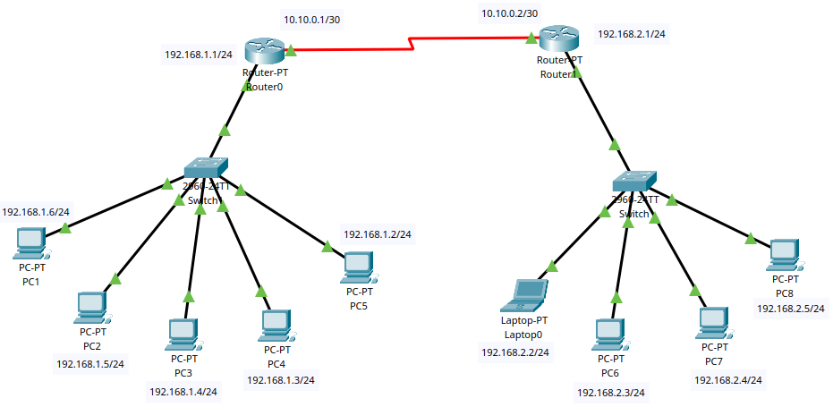

**Composants réseaux**: PC, Router, Switch, Cable serial dte and crossover cable.

**Steps**:
1. Connecter les PC1-PC5  au Switch1
- PC1: 192.168.1.6/24  Default Gateway: 192.168.1.1
- PC2: 192.168.1.5/24  Default Gateway: 192.168.1.1
- PC3: 192.168.1.4/24  Default Gateway: 192.168.1.1
- PC4: 192.168.1.3/24  Default Gateway: 192.168.1.1
- PC5: 192.168.1.2/24  Default Gateway: 192.168.1.1

2. Connecter les PC6-PC8 et le laptop au Switch2
- Laptop0 192.168.2.2/24  Default Gateway: 192.168.2.1
- PC6: 192.168.2.3/24  Default Gateway: 192.168.2.1
- PC7: 192.168.2.4/24  Default Gateway: 192.168.2.1
- PC8: 192.168.2.5/24  Default Gateway: 192.168.2.1

3. Donner les routes pour chaque routeurs

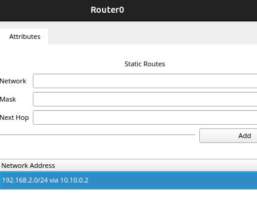
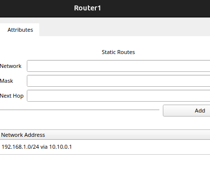

4. Tester la connectivité à l'aide de la commande `ping` et les simulations.

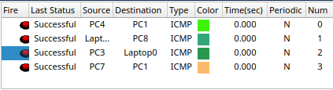

### Exercise 8:

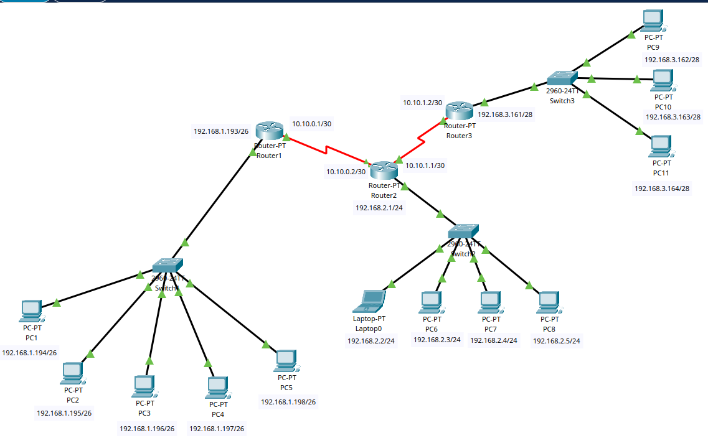

**Composants réseaux**: PC, Router, Switch, Cable serial dte and crossover cable.

**Steps**:
1. Connecter les PC1-PC5  au Switch1
- PC1: 192.168.1.6/24  Default Gateway: 192.168.1.1
- PC2: 192.168.1.5/24  Default Gateway: 192.168.1.1
- PC3: 192.168.1.4/24  Default Gateway: 192.168.1.1
- PC4: 192.168.1.3/24  Default Gateway: 192.168.1.1
- PC5: 192.168.1.2/24  Default Gateway: 192.168.1.1

2. Connecter les PC6-PC8 et le laptop au Switch2
- Laptop0 192.168.2.2/24  Default Gateway: 192.168.2.1
- PC6: 192.168.2.3/24  Default Gateway: 192.168.2.1
- PC7: 192.168.2.4/24  Default Gateway: 192.168.2.1
- PC8: 192.168.2.5/24  Default Gateway: 192.168.2.1

3. Donner les routes pour chaque routeurs

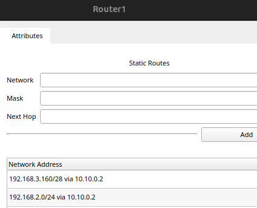
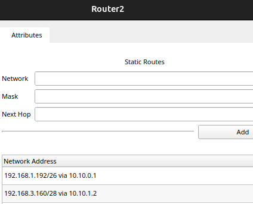

4. Tester la connectivité à l'aide de la commande `ping` et les simulations.

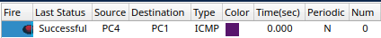
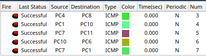
